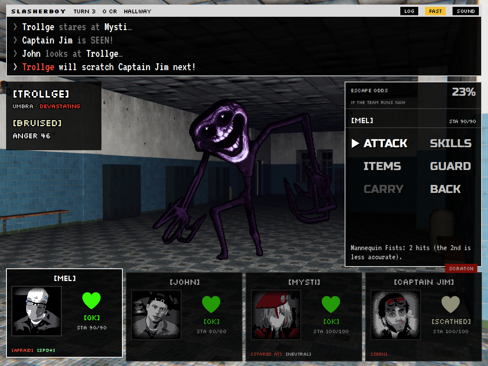
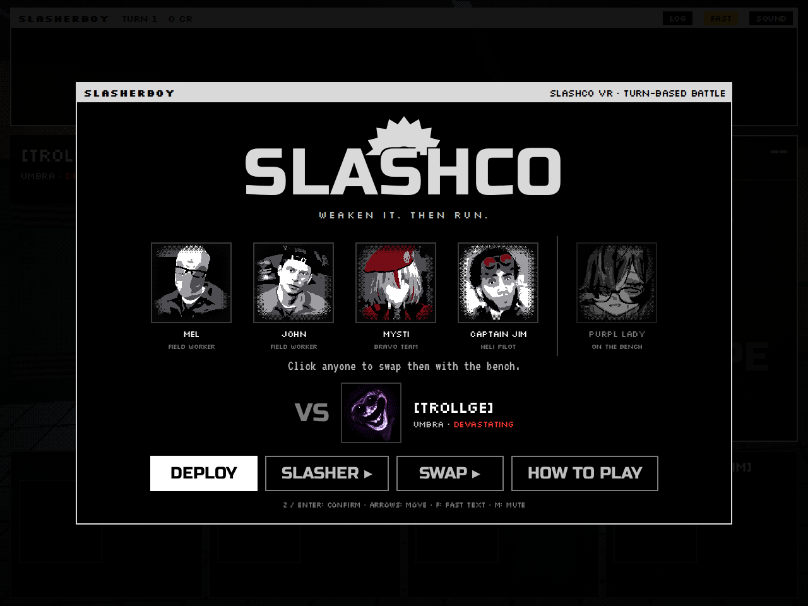
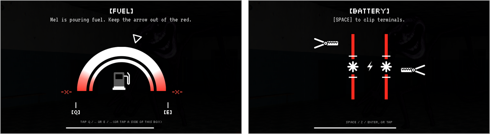
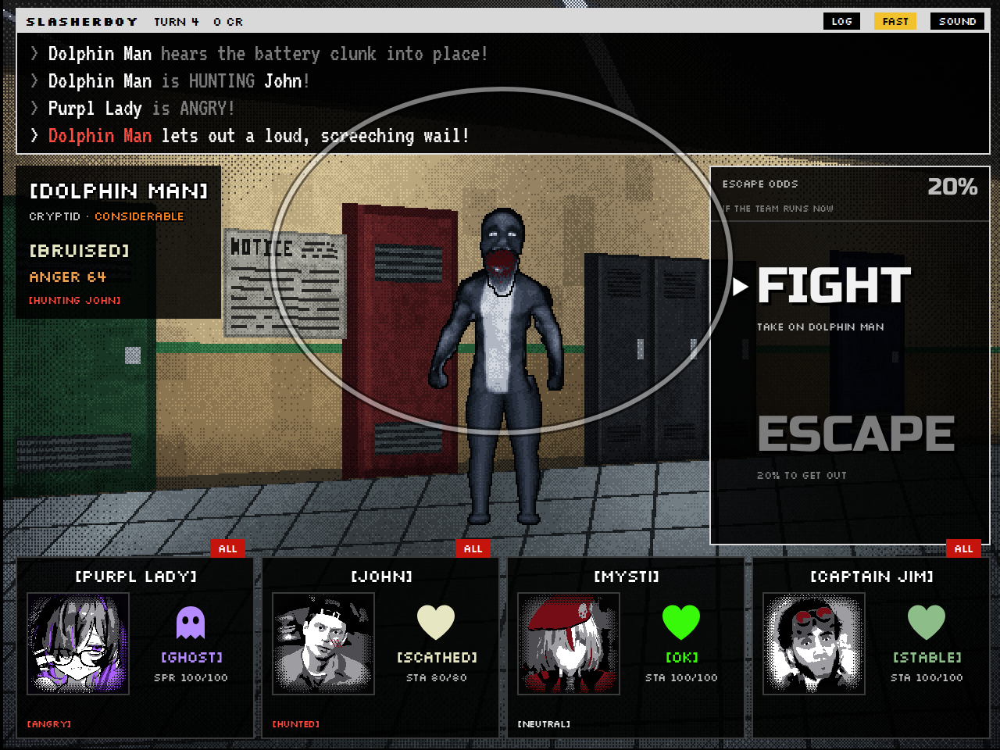

# SlashCo VR: Turn-Based Battle

A turn-based battle based on [SlashCo VR](https://slashco-vr.fandom.com/wiki/SlashCo_VR_Wiki), with a black-and-white
HUD styled after the game's own. **Mel, John, Bravo Team Mysti and Captain Jim** are backed into a corner in a
locker hallway against **Trollge** [DEVASTATING]. **Purpl Lady** waits on the bench and can swap in for anyone.
Switch slashers on the title screen: **Sid** [CONSIDERABLE] and **Dolphin Man** [CONSIDERABLE] are the other two
fights. Every stat, skill, passive, weapon and item comes from the *Slasher Statistics* doc.



## Play

Open `index.html` in a browser. There is nothing to install or build, and it works offline.

| Action | Keys | Mouse / touch |
| --- | --- | --- |
| Move | Arrows or WASD | Hover |
| Confirm | Z, Enter, Space | Click / tap |
| Back / undo | X, Esc, Backspace | "BACK" / "UNDO" |
| Skip text | Z or X while text types | Click SLASHERBOY |
| Fuel check | Tap Q / E (or ← / →) | Tap a side of the box |
| Battery check | Space, Z, Enter | Tap |
| Swap the squad | SWAP ▸ on the title screen | Click a portrait on the title screen |
| Change slasher | SLASHER ▸ on the title screen | |
| Your own music | MUSIC on the title screen | |
| Battle log | L | LOG button |
| Fast text | F | FAST button |
| Sound | M | SOUND button |
| How to play | H | Title screen |

## The HUD

It follows SlashCo VR's own HUD: white text in square brackets, and health shown as a coloured word under a heart
rather than a bar.

- **SLASHERBOY** (top), the computer in SlashCo's monitor room, prints the battle log. Its title bar shows the turn,
  your CREDITS and the heli's ETA.
- **The slasher** (left): `[TROLLGE]`, its class and danger level (MODERATE yellow, CONSIDERABLE orange,
  DEVASTATING red), its condition (its doc health, such as `[GOOD]` or `[OK]`, down to `[WEAKENED]`) and its
  ANGER, which turns orange and then red as it nears 80.
- **The profiles** (bottom): each worker's `[NAME]`, portrait, a heart in their health colour with the word under
  it, their STAMINA, and their statuses in brackets (`[SEEN]`, `[HUNTED]`, `[GUARD]`, `[CARRYING MEL]`…).

  | `[OVERSATED]` `[SATED]` | `[OK]` | `[STABLE]` | `[SCATHED]` | `[HURT]` | `[CRITICAL]` | `[DEAD]` | `[GHOST]` |
  | --- | --- | --- | --- | --- | --- | --- | --- |
  | cyan heart | bright green | pale green | cream | amber | orange skull and crossbones | grey skull | Purpl Lady's violet ghost |

  OK, STABLE, SCATHED and CRITICAL use the colours from the game's own HUD; the rest are filled in between. When
  John is awake, his *Hyperceptive* puts a red flag (STARE, SCRATCH, TARGET, ALL) on whoever the slasher goes for
  next.
- **The menu** (right): **FIGHT** and **ESCAPE**, then ATTACK, SKILLS, ITEMS, GUARD and CARRY, in blocky letters
  like the SLASHCO logo. The escape odds sit at the top; click them to see how they add up.

## The squad



Four workers go in and the fifth waits on the bench (Purpl Lady, to start with). On the title screen, click anyone
on the team to swap them with whoever is on the bench, or press **SWAP ▸** to move Purpl Lady along the line. The
game remembers the squad you picked.

Purpl Lady is a ghost: slashers' attacks pass through her, she can't carry bodies or use items, and once the
slasher is weakened she POSSESSES a body so it walks out on its own. Her Freaky Doctor passive protects the team
a little (-5% damage taken, +15% healing, +5% ATK) and brings the first worker to die back once. That makes her the
strongest swap, especially against Trollge (see the numbers below), though she's been toned down a little.

### Purpl Lady's moods

Every turn she feels **HAPPY**, **ANGRY** or **SAD** (*Mood Swings*). Her profile shows it as a tag, and her Hex
(her ATTACK) changes with it:

- **HAPPY**: the slasher calms down (ANGER -8) and every worker heals a little.
- **ANGRY**: real MAGIC damage, and the slasher's DEF drops 20% for 2 turns.
- **SAD**: the slasher is weighed down: ATK and SPD drop 20% for 2 turns.

## Generator checks



Mel's *Fuel Skill Check* and John's *Battery Skill Check* are drawn after SlashCo VR's generator checks:

- **Fuel.** The ▽ marker loses its balance: the further it leans, the faster it falls, a gust keeps shoving it
  one way or the other, and it gets worse as the pour goes on. Every tap of **Q** or **E** makes it jump back a
  little, so keep tapping to hold it over the top until the pump fills up. Touch the red `-X-` ends and the can
  lands on Mel's foot.
- **Battery.** "[SPACE] to clip terminals." The two clips bounce up and down at random speeds and change direction
  at random, so it's all about timing: press when **both** clips are level with the middle of the terminals (the
  ✱, between the white marks). Miss, or run out of time, and the ⚡ turns into a yellow ⚠ as the generator shocks
  John.
- With Purpl Lady in the squad (*Moral Support*), the fuel arrow falls slower, and the clips move slower and
  change direction less often.
- Both get harder when the Loud Wail lowers the worker's SMARTS.

## How the battle works

- **You can't kill a slasher.** Weaken it until its condition reads **[WEAKENED]** ("Trollge is weakened! Now is
  your time for escape!"). It then can't move for a turn or two. Pick **ESCAPE** to try to get out.
- **Nobody gets left behind.** A dead worker has to be **CARRIED** by a living one before the team can run.
  Carrying slows the carrier and lowers the escape chance.
- **Health is a condition, not a number**, as in the doc: CRITICAL, HURT, SCATHED, STABLE, OK, SATED, OVERSATED
  (percent ranges from the doc).
- **The heli.** Captain Jim's *Helicopter Escape* lands after 5 turns and gets everyone out, bodies included, as
  long as someone who can carry a body is still alive.
- The battle log follows the doc's *Battle Dialogue* example ("John looks at Trollge… Trollge will scratch
  Captain Jim next!", "Mel survives on the edge of life!", "John picks up Mel's body! John's speed decreases!").

### Trollge [DEVASTATING]

- **It only sees what moves.** *Static Stare* marks a worker as **STARED AT**. Until the end of the next turn,
  anything but GUARD counts as moving: they become **SEEN** and its ANGER jumps by 20. Guard and hold still. A
  stare needs no touch, so it works on Purpl Lady too (FOCUS keeps her still).
- **Scratch** hits very hard, and only someone who is SEEN.
- **Statokinetic Dissociation**: its claws mostly miss whoever hasn't moved yet this turn, or is guarding.
- **Claws** make you AFRAID on hit (very brave workers can shrug it off). Its grin (*Trollface*) can scare the
  less brave before the fight even starts.
- **Slow Walker, Fast Runner.** At 80 ANGER its speed jumps from 12 to 77: it moves first, comes back around for a
  second attack after everyone, marks someone SEEN every turn, and it's much harder to outrun. Escape before
  that happens, or hold on until the heli.
- Mysti's *Tactical Stab* is "extremely effective against Trollge".

### Sid [CONSIDERABLE]

- **ANGER** rises every turn and whenever he's hurt, and he hits harder the angrier he gets. From 60 he follows
  his move with a second attack every turn. At 80 he draws his Desert Eagle and can no longer eat cookies to
  calm down. If anyone on your team eats a Cookie, his ANGER jumps by 35 (METH Addict).
- GUARD whoever John flags as the **TARGET**, heal them first, or have Captain Jim set a *Bear Trap* at their feet.

### Dolphin Man [CONSIDERABLE]



- **He can barely see** (*Eyes of the Angry*). At low ANGER his slaps and *Tail Whip* miss most of the time; the
  angrier he gets, the better he sees, and at 80 his milky eyes clear up and he sees everything.
- **Dolphin Hands**: his slaps hit 5 times, and he heals a little from the damage. **Tail Whip** hits once and
  hard, with his DEF instead of his ATK (so lowering his DEF softens it), and angers him a little.
- **Loud Wail** hits everyone three times, harder the angrier he is, and lowers SPEED and SMARTS for 2 turns. It's
  sound, so DEF doesn't help, but GUARD does.
- **Mucus Layer**: punches, slaps, stabs and thrown things sometimes slip off his skin for a quarter of the
  damage. Magic, shocks, blasts, bleeding and traps don't slip.
- **He hunts by sound.** A battery going in, glass breaking, a ringing phone, a blast, Captain Jim yelling about
  his locker: loud things anger him (more the angrier he already is), and he goes after whoever made them for 2
  turns, seeing them better (**HUNTED**). Camouflage doesn't hide you from him once he's hunting you.
- **Fetal Position.** Now and then he curls up on the floor: he can't attack and his DEF shoots up, but every noise
  angers him twice as much, and every hit is a noise. Use the time to heal, guard, buff or run.

## Music and sound

The music switches between an **ambience** and a **chase**. The chase comes in at desperate moments: once the
slasher is weakened, when the team makes a run for it (that turn and the next), and when the team is about to
lose (one worker left standing, everyone left CRITICAL, or two left and both HURT or worse).

**SlashCo VR's own music.** The game doesn't ship the game's soundtrack (it's the composers' work; zimzbooth's
*SlashCo VR Compositions Vol. 1* and Kamija's *SlashCo VR OST V.1* are on Bandcamp). Bring your own copy and the
game plays it exactly as it is:

- On the title screen, press **MUSIC** and pick the audio files from your device. They stay in your browser (it
  remembers them) and aren't uploaded anywhere. This works on the shared page too.
- **One file**, like the SlashCo ambience video: everything before 2:22 is the ambience and loops; everything
  from 2:22 on is the chase. The time can be changed in the MUSIC window.
- **Two files**: the ambience and the chase (the one with "chase" in its name is the chase).
- A file with "wail" in its name replaces Dolphin Man's wail.
- Or, when you play from this folder, put them in `assets/audio/`: `slashco.mp3` (one file, split at 2:22), or
  `ambience.mp3` and `chase.mp3`, and `wail.mp3` (`.ogg` works too).

**Built-in sound**, used when you haven't picked any files. It's all synthesized in the browser:

- **Ambience**: a low hallway drone with the strip lights buzzing, and things clanking, thudding and creaking far
  away.
- **Chase**: a heartbeat and a pounding bass line.
- **Dolphin Man's Loud Wail** is modelled on his sound in SlashCo VR gameplay footage: a shrill band of noise
  around 3.2 kHz that buzzes about 50 times a second and swells again and again, over a hoarse, wobbling scream.

**M** mutes everything.

## Tuning and editing

Everything is in **`js/data.js`**: stats, skill costs and power, passives, items, the starting bag, health
states, each slasher's AI weights, the escape formula, the skill checks' timing, and the default squad (`party`)
and bench (`bench`). The doc's text is quoted word for word in `doc:` fields and shown in the in-game skill and
item menus. Save and refresh. The skill checks' physics (how fast the fuel arrow falls, how far a tap moves it,
how fast the clips move) are at the top of `js/checks.js`.

`npm test` (or `node tests/simulate.js`) plays hundreds of battles against each slasher with three play styles,
with the default squad and with Purpl Lady swapped in for each worker in turn. It checks for crashes and broken
states and prints win rates:

| | careful play | casual play | button mashing |
| --- | --- | --- | --- |
| Trollge | 85% | 37% | 35% |
| Trollge, Purpl Lady in for Mel | 97% | 62% | 36% |
| Trollge, Purpl Lady in for John | 99% | 60% | 50% |
| Trollge, Purpl Lady in for Mysti | 81% | 35% | 39% |
| Trollge, Purpl Lady in for Captain Jim | 95% | 36% | 25% |
| Sid | 98% | 71% | 39% |
| Sid, with Purpl Lady in | 98–100% | 67–94% | 31–57% |
| Dolphin Man | 99% | 65% | 49% |
| Dolphin Man, with Purpl Lady in | 99–100% | 52–92% | 40–73% |

Against Trollge with the default squad, someone dies in most casual battles. Careful play against Dolphin Man
means not hitting him while he's curled up.

## Choices I made where the doc leaves room

- **Bravo Team Mysti.**
  - Her *Knife* always makes the slasher BLEED, and parries 15% of close-range attacks.
  - *BRAVO Team Uniform*: all stats +10% while she's NEUTRAL (not AFRAID, CONFUSED, HAPPY or boosted).
  - *Tactical Stab* ignores DEF, adds 5% of the slasher's current health, and is x1.5 against Trollge.
  - *Exterminate*: slashers can't be killed, so the 8% "instant elimination" drops it straight to BARELY
    STANDING. Otherwise it's a heavy hit. Either way, she takes +50% damage this turn and next.
  - *Hidden Documents* works 85% of the time. It shows the slasher's exact numbers and one secret, and a win pays
    +20 CREDITS and +50% EXP (the end screen shows EXP).
  - *Deity Swindler*: she applies the **DEATHWARD** (one in the bag). For 3 turns nobody on the team can die.
  - *First Responder* heals a teammate to 50 (SCATHED) the first time they reach CRITICAL.
  - *Balkan Warrior* skips the Balkan Boost crash. *Need For Revenge* only matters against The Watcher.
- **Trollge.**
  - *Static Stare* lasts until the end of the next turn, and SEEN lasts 3 turns. It can stare at Purpl Lady, but
    being caught only angers it: its Scratch would pass straight through her.
  - Its speed at 80 ANGER is from the doc ("Spd: 12 -> 77"). Acting a second time each turn is my reading of
    "massively increases SPEED": with one attack a turn it couldn't threaten four workers, especially with the
    heli's 5-turn guaranteed escape.
  - Trollge's HP isn't in the doc; it has 4000 ("Health: Good"). Wounds anger it less than Sid, so its ANGER
    mostly comes from time and from workers caught moving under its stare.
- **Dolphin Man.**
  - His stats, skills, passive, weapon and armor are the doc's. His HP isn't in the doc; he has 2400 ("Health:
    OK"). With ATK 17, ANGER is what makes him dangerous: +1.5% ATK per point (x2.2 at 80).
  - *Eyes of the Angry*: 30% of the usual HIT RATE at 0 ANGER, rising to full at 100.
  - Hunting by sound comes from SlashCo VR itself (the gameplay video's captions: loud noises "made by smashing
    glass bottles or installing a battery will trigger the Dolphinman, entering it's [Hunt] State", his eyesight
    improves while hunting, and his hearing gets sharper as his ANGER rises). Here that means John's battery
    check, Mel's *Toss Glasses*, Captain Jim's phone and Proxy Locator, blasts, and Jim's locker-yelling on GUARD.
  - *Fetal Position* lasts the rest of the turn and the next, with DEF +80%. The doc says it "increases ANGER from
    most sources of sound"; every blow landing on him counts as one.
  - *Dolphin Hands* heals him 1.5 health per point of damage it deals. *Mucus Layer* makes 30% of physical hits
    slip, doing a quarter of their damage.
- **Purpl Lady's Mood Swings** isn't in the doc; it was added on request, along with the mood-based Hex above
  (her doc Hex is "a random debuff").
- **Captain Jim.** His *Burner Phone* hits once but hard, and sometimes rings (NOISE). *Proxy Locator* is an
  on/off switch. *Bear Trap* stops the attack it catches. *Confidential Documents* shows the slasher's exact
  numbers and adds +10% team crit. *Full Blood Aussie* halves the ANGER his actions cause and makes items 30%
  stronger on him.
- **Mel, John, Mysti and Captain Jim's STA is STAMINA.** It pays for skills and refills a little each turn and
  when guarding. Purpl Lady's SPR is SPIRIT, which only comes back when she FOCUSES.
- **Numbers the doc describes in words** ("slightly", "drastically", "a short number of turns") are turned
  into values in `data.js` and tuned with the simulator.
- **Items the doc mentions but doesn't list** are included: *Pocket Sand* (for Mel's *Batter Up*), the *Balkan
  Boost* (from the battle dialogue example), an *Empty Bottle* so Mel's *Uncle Sink* has something to drink, and
  Mysti's *DEATHWARD*. The *Master Lock 607* is in the bag too. It does nothing, as the doc says.
- **Carrying slows even John.** The doc's example has "John's speed decreases!" when he picks up Mel, so
  carrying ignores *Speed Addict*.

## Art

- **Portraits** are made from the reference images in `assets/source/` by `tools/make_images.py`:
  - Mel and John come from the SlashCo VR lobby-NPC screenshot.
  - Mysti is from her in-game render (red beret, white mask).
  - Captain Jim is from his in-game render.
  - Purpl Lady is from her new reference, cropped to her head and shoulders (glasses, violet streaks).
  - Trollge's title-screen card is its head, Dolphin Man's is his wailing head, and Sid's red card is the art
    from the doc.

  Nobody is cut out of their picture: each worker keeps the background they were captured against, softened and
  darkened so the face reads first, and posterized into the black / grey / white style of the doc's art. Red stays
  red (Jim's goggles, Mysti's beret) and violet stays violet (Purpl Lady's hair). In the game the edges fade into
  a dark backdrop, the picture turns red when they're CRITICAL, and effects go on top: sweat, blood, cracks, Zzz.
  Mel's no-glasses face (after *Toss Glasses*) and John's sleeping face (*Nap*) are edited versions.
- **Trollge** is its render shrunk into dithered pixel art, with the head on a separate layer so "the large head
  wobbles on its skinny body". It freezes when it stares, its eyes glow red once it's a Fast Runner, and it folds
  up when weakened.
- **Dolphin Man** is made the same way from his two renders: his head bobs and twitches on his neck like
  Trollge's, his mouth hangs open while he wails, he spins round for the Tail Whip, his eyes clear up at 80 ANGER,
  and in Fetal Position (and when he's weakened) he's curled up on the floor. His legs and the curled-up pose are
  drawn to match the renders, which don't show them.
- **The hallway and Sid** are drawn in code (`js/art.js`) as dithered pixel art at 2x. Sid is drawn to the
  proportions of the in-game screenshot in `assets/source/sid_reference.png`.
- **Type:** Russo One for the big words (FIGHT, ATTACK, SLASHCO), the closest free match to the SLASHCO logo;
  Silkscreen for the bracketed HUD text, like the game's; VT323 for SLASHERBOY's screen. All three are bundled.
- To rebuild the portraits and sprites after changing a source image: `pip install numpy opencv-python-headless
  pillow`, then `python3 tools/make_images.py`.

## Files

```
index.html            the page
css/style.css         the HUD (a 1280x960 stage, scaled to fit)
js/data.js            all stats, skills, items and tuning  ← edit this
js/battle.js          the turn engine (no DOM; also runs in Node)
js/checks.js          the generator checks' rules (no DOM)
js/ui.js              HUD, menus, targeting, animations, generator checks, title screen and squad
js/art.js, pixel.js   hallway, Sid, Trollge and Dolphin Man's moving sprites, portrait cards
js/images.js          portraits and sprites (generated)
js/audio.js           sound effects, the wail, the ambience and chase music (built-in or your own files)
js/main.js            title → battle → end loop
tests/simulate.js     headless balance and crash test
tools/make_images.py  builds the portraits and sprites
assets/               fonts (SIL OFL, see assets/fonts/OFL.txt), portraits, sprites, source images
```

SlashCo VR is by Mantibro. This is a fan project.
