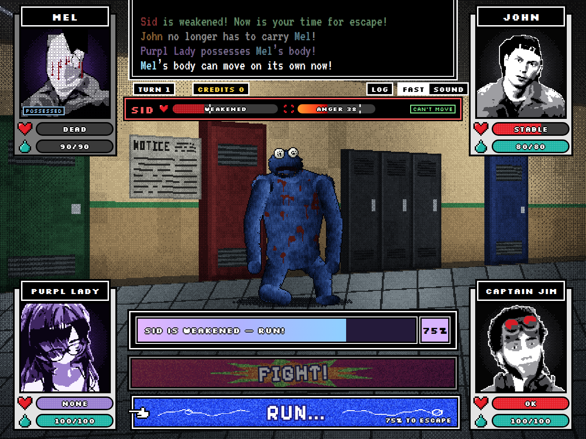

# SlashCo VR: Turn-Based Battle

An OMORI-style, turn-based battle based on [SlashCo VR](https://slashco-vr.fandom.com/wiki/SlashCo_VR_Wiki).
**Mel, John, Purpl Lady and Captain Jim** are backed into a corner in a locker hallway against **Sid**.
Every stat, skill, passive, weapon and item comes from the *Slasher Statistics* doc.


## Play

Open `index.html` in a browser. There is nothing to install or build, and it works offline.

| Action | Keys | Mouse / touch |
| --- | --- | --- |
| Move | Arrows or WASD | Hover |
| Confirm | Z, Enter, Space | Click / tap |
| Back / undo | X, Esc, Backspace | "BACK" / "UNDO" |
| Skip text | Z or X while text types | Click the log |
| Battle log | L | LOG button |
| Fast text | F | FAST button |
| Mute | M | SOUND button |
| How to play | H | Title screen |

## How the battle works

- **You can't kill a slasher.** Weaken Sid until his bar reads **WEAKENED** ("Sid is weakened! Now is your
  time for escape!"). He then can't move for a turn or two. Pick **RUN...** to try to escape. The bar above the
  buttons shows your odds; click it to see how they add up.
- **Nobody gets left behind.** A dead worker has to be **CARRIED** by a living one before the team can run.
  Carrying slows the carrier and lowers the escape chance. Purpl Lady is a ghost and can't carry anyone, but
  once Sid is weakened she **possesses** a body so it walks out on its own.
- **Sid isn't one of your cards.** His health and ANGER sit on the plate above him.
- **ANGER** rises every turn and whenever he's hurt, and he hits harder the angrier he gets. From 60 he follows
  his move with a second attack every turn. At 80 he draws his Desert Eagle and can no longer eat cookies to
  calm down. If anyone on your team eats a Cookie, his ANGER jumps by 35 (METH Addict).
- **Read his next move.** John's *Hyperceptive* marks who Sid will hit first (TARGET). Purpl Lady's *Foresight*
  or Captain Jim's *Confidential Documents* say how hard. GUARD the target, heal them first, or have Jim set a
  *Bear Trap* at their feet.
- **The chopper.** Captain Jim's *Helicopter Escape* lands after 5 turns and gets everyone out, bodies
  included, as long as someone who can carry a body is still alive.
- **Health is a condition, not a number**, as in the doc: CRITICAL, HURT, SCATHED, STABLE, OK, SATED,
  OVERSATED (percent ranges from the doc; the gold stripe is health above 100%).
- **Skill checks.** Mel's *Fuel Skill Check* and John's *Battery Skill Check* are timing mini-games: press when
  the needle is in the green. Purpl Lady's *Moral Support* widens the green.
- The battle log follows the doc's *Battle Dialogue* example ("John looks at Sid… Sid will hit Mel next!",
  "Mel survives on the edge of life!", "John picks up Mel's body! John's speed decreases!", …).



## Tuning and editing

Everything is in **`js/data.js`**: stats, skill costs and power, passives, items, the starting bag, health
states, Sid's AI weights, and the escape formula. The doc's text is quoted word for word in `doc:` fields and
shown in the in-game skill and item menus. Save and refresh.

`npm test` (or `node tests/simulate.js`) plays hundreds of battles headlessly with three play styles, checks
for crashes and broken states, and prints win rates. With the current numbers, careful play wins nearly every
time. Playing casually wins about two thirds of the time, and someone dies in more than half of those battles.

## Choices I made where the doc leaves room

- **Purpl Lady, "Health: None".** She's a ghost: physical hits and bullets pass through her, but Sid's
  *Psychotic Claims* still gets into her head (Bravery 10). Her teal bar is **SPIRIT**, which pays for her
  skills. *Freaky Doctor* drains 3 SPIRIT a turn ("hurt your own wellbeing"), and only **FOCUS** refills it.
  Her basic attack is **HEX** (Magic Book: no damage, a random debuff). The battle is lost when no one who can
  carry a body is left alive.
- **Mel, John and Captain Jim's teal bar is STAMINA.** It pays for skills and refills a little each turn and
  when guarding.
- **Captain Jim.**
  - His *Burner Phone* hits once but hard, and sometimes rings (NOISE, a little ANGER).
  - *Proxy Locator* is an on/off switch.
  - *Bear Trap* stops the attack it catches.
  - *Confidential Documents* shows Sid's exact numbers and adds +10% team crit.
  - *Helicopter Escape* costs 70 STAMINA and can be called once.
  - *Full Blood Aussie* halves the ANGER his actions cause and makes items 30% stronger on him.
- **"Who the enemy will hit first."** Hyperceptive's wording suggests Sid can hit more than once, so at 60+
  ANGER he gets a follow-up attack each turn. That also keeps four workers from steamrolling him.
- **Numbers the doc describes in words** ("slightly", "drastically", "a short number of turns") are turned
  into values in `data.js` and tuned with the simulator.
- **Sid's HP** is not in the doc; his "Unhealthy" health is his normal state on the plate, and he has 2000 HP.
- **Items the doc mentions but doesn't list** are included: *Pocket Sand* (for Mel's *Batter Up*), the
  *Balkan Boost* (from the battle dialogue example), and an *Empty Bottle* so Mel's *Uncle Sink* has something
  to drink. The *Master Lock 607* is in the bag too. It does nothing, as the doc says.
- **Carrying slows even John.** The doc's example has "John's speed decreases!" when he picks up Mel, so
  carrying ignores *Speed Addict*.

## Art

- **Portraits** are made from the reference images in `assets/source/` by `tools/make_portraits.py`:
  - Mel and John come from the SlashCo VR lobby-NPC screenshot.
  - Purpl Lady is from art by @Shouyou97.
  - Captain Jim is from his in-game render.
  - Sid's red card (title screen) is the art from the doc.

  Each one is cut out of its background and posterized into the black / grey / white style of the doc's art.
  Purpl Lady is tinted purple; Jim keeps his red goggles. Mel's no-glasses face (after *Toss Glasses*) and
  John's sleeping face (*Nap*) are edited versions. The game adds OMORI-style mood backdrops and effects on
  top: sweat, blood, cracks, Zzz, a yellow HAPPY glow.
- **The hallway and Sid** are drawn in code (`js/art.js`) as dithered pixel art at 2x. Sid is drawn to the
  proportions of the in-game screenshot in `assets/source/sid_reference.png`: a big man in a blood-stained
  bodysuit with a small costume head. His googly eyes wander and he breathes. He eats a giant cookie with both
  hands, raises the Desert Eagle, and drops to one knee when weakened.
- To rebuild portraits after changing a source image: `pip install numpy opencv-python-headless pillow`, then
  `python3 tools/make_portraits.py`.

## Files

```
index.html            the page
css/style.css         the HUD (laid out on the 1280x960 OMORI template)
js/data.js            all stats, skills, items and tuning  ← edit this
js/battle.js          the turn engine (no DOM; also runs in Node)
js/ui.js              HUD, menus, targeting, animations, skill checks
js/art.js, pixel.js   hallway, Sid, icons, banners, portrait cards
js/portraits.js       portrait images (generated)
js/audio.js           synthesized sound effects
js/main.js            title → battle → end loop
tests/simulate.js     headless balance and crash test
tools/make_portraits.py
assets/               fonts (SIL OFL, see assets/fonts/OFL.txt), portraits, source images
```

SlashCo VR is by Mantibro. This is a fan project.
